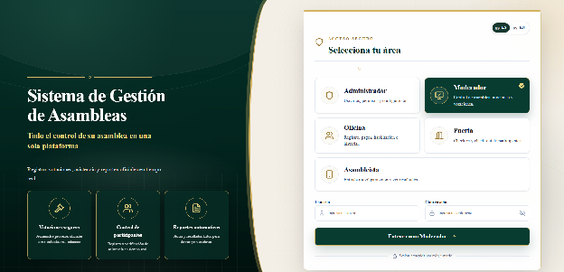
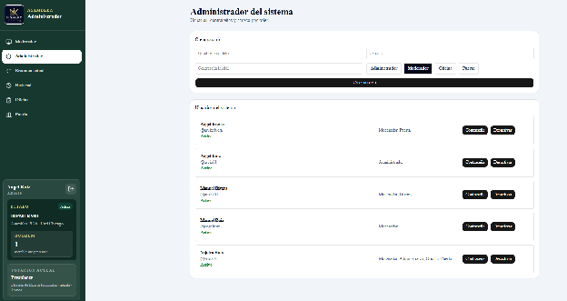
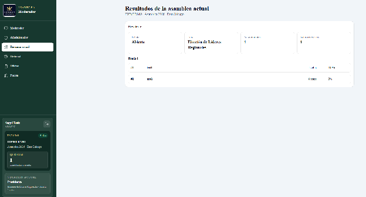
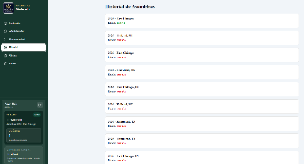
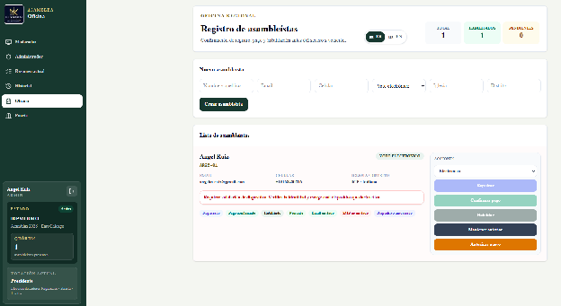
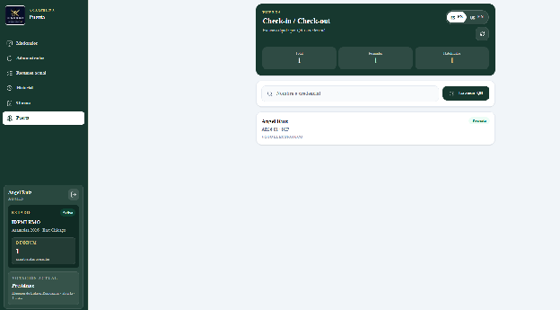
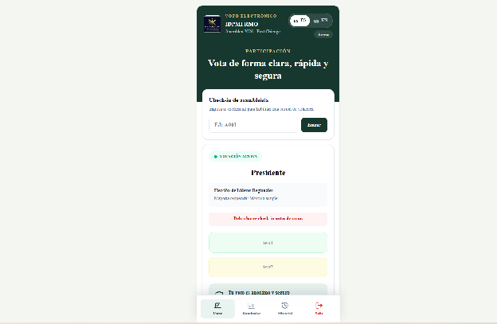

# Manual del Sistema de Gestión de Asambleas

**Kingdom Tech Group**  
**Sistema de voto electrónico, registro y control de asamblea**  
**Versión:** 1.0  
**Fecha:** 8 de junio de 2026

---

## 1. Propósito del sistema

El Sistema de Gestión de Asambleas permite administrar el proceso completo de una asamblea desde una sola plataforma. El sistema centraliza el acceso por roles, el registro de asambleístas, el control de presencia, la votación electrónica, los resultados, el historial y la validación de dispositivos autorizados.

El objetivo principal es que la asamblea pueda operar de forma ordenada, segura y verificable, manteniendo la confidencialidad del voto y reduciendo errores manuales durante el evento.

---

## 2. Roles principales

El sistema está dividido por áreas de trabajo. Cada usuario debe seleccionar el módulo correspondiente según su función.

### 2.1 Administrador

El Administrador gestiona usuarios, roles y permisos del sistema. Este módulo se utiliza antes del evento para confirmar que cada persona autorizada tenga acceso al área correcta.

### 2.2 Moderador

El Moderador controla el desarrollo de la asamblea. Desde este módulo puede abrir o cerrar votaciones, administrar mociones, revisar resultados y controlar el estado operativo de la asamblea.

### 2.3 Comité de Escrutinio

El Comité de Escrutinio registra los votos manuales después de cerrar una votación electrónica. Este módulo permite sumar balotas manuales al resultado oficial, revisar el resumen final y preparar la lectura para el presidente de la asamblea.

### 2.4 Oficina

El módulo de Oficina se usa para registrar asambleístas, confirmar pagos, habilitar participantes y resolver casos de validación de dispositivos.

### 2.5 Puerta

El módulo de Puerta se usa para hacer check-in y check-out de participantes mediante búsqueda manual o escaneo de código QR.

### 2.6 Asambleísta

El Asambleísta usa la pantalla móvil para acreditarse, votar, nominar candidatos cuando aplique y consultar resultados.

---

## 3. Acceso al sistema

1. Ingrese a la dirección del sistema.
2. Seleccione el área correspondiente: Administrador, Moderador, Comité de Escrutinio, Oficina, Puerta o Asambleísta.
3. Para roles administrativos, ingrese usuario y contraseña.
4. Para Asambleísta, el acceso continúa por credencial en la pantalla móvil.
5. Use el selector de idioma para cambiar entre Español e Inglés.

El selector de idioma usa la bandera de España para Español y la bandera de Estados Unidos para Inglés.

---

## 4. Panel lateral de sesión y estado de asamblea

En los módulos administrativos, el sistema muestra un panel lateral con información rápida sobre el usuario conectado y el estado actual de la asamblea.

Este panel permite confirmar, sin salir de la pantalla actual, quién está operando el sistema y en qué estado se encuentra la asamblea.

### 4.1 Usuario conectado

En la parte superior del panel aparece el nombre del usuario conectado y su rol.

Ejemplo:

- **Angel Ruiz**
- **ADMIN**

Esto ayuda a confirmar que la persona está usando el perfil correcto antes de ejecutar acciones sensibles como abrir votaciones, habilitar asambleístas o validar dispositivos.

El botón con ícono de salida permite cerrar sesión y regresar a la pantalla de acceso.

### 4.2 Estado de la asamblea

El bloque **Estado** muestra la asamblea activa y su condición operacional.

Ejemplo:

- **IDPMI RMO**
- **Asamblea 2026 - East Chicago**
- Estado: **Activa**

Cuando el estado aparece como **Activa**, significa que la asamblea está disponible para operar. Si la asamblea está en receso o cerrada, las acciones disponibles pueden cambiar según el módulo.

### 4.3 Quórum

El bloque **Quórum** muestra la cantidad de asambleístas presentes en ese momento.

Ejemplo:

- **1 asambleísta presente**

Este número se actualiza con los check-in y check-out realizados desde Puerta u Oficina. Sirve para que el Moderador y el equipo administrativo tengan una referencia rápida de asistencia antes de iniciar votaciones.

### 4.4 Votación actual

El bloque **Votación actual** muestra la votación que está abierta o activa en ese momento.

Ejemplo:

- **Presidente**
- **Elección de Líderes Regionales**
- Estado: **abierta**
- **1 voto**

Este bloque permite saber rápidamente si hay una votación en curso y cuántos votos se han registrado. Si no hay votación activa, el panel puede mostrar que no existe una votación abierta.

### 4.5 Uso recomendado del panel lateral

Antes de operar durante la asamblea, el usuario debe revisar este panel para confirmar:

1. Que está conectado con el rol correcto.
2. Que la asamblea correcta está activa.
3. Que el quórum refleja la asistencia esperada.
4. Que la votación actual corresponde al punto que se está trabajando.

---

## 5. Módulo Administrador

El módulo Administrador permite crear y controlar usuarios del sistema.

### Funciones principales

1. Crear usuarios autorizados.
2. Asignar roles.
3. Activar o desactivar usuarios.
4. Verificar que cada usuario tenga el acceso correcto.

### Procedimiento recomendado

1. Antes de la asamblea, confirmar que existan usuarios para Moderador, Comité de Escrutinio, Oficina y Puerta.
2. Revisar que los usuarios activos sean únicamente los necesarios para el evento.
3. Desactivar cualquier usuario que no deba operar durante la asamblea.
4. Probar el acceso de cada rol antes del día de la presentación.

---

## 6. Resultados de la asamblea actual

La pantalla de resultados muestra el estado de las votaciones de la asamblea activa.

### Información disponible

1. Estado de la votación.
2. Título de la moción o elección.
3. Número de votos emitidos.
4. Resultados por opción.
5. Porcentajes o conteos según el tipo de votación.

### Uso durante la asamblea

El Moderador debe usar esta pantalla para revisar los resultados una vez se cierre una votación. Los resultados deben anunciarse siguiendo el procedimiento oficial de la asamblea.

---

## 7. Historial de asambleas

El historial permite consultar asambleas anteriores.

### Uso del historial

1. Ingresar al módulo Historial.
2. Seleccionar la asamblea que se desea revisar.
3. Consultar los resultados y registros disponibles.
4. Usar esta información para auditoría o referencia interna.

El historial sirve como respaldo operacional para verificar procesos anteriores y mantener trazabilidad.

---

## 8. Módulo Comité de Escrutinio

El módulo de Comité de Escrutinio separa la entrada de votos manuales del trabajo del Moderador. Su propósito es que el presidente del comité pueda registrar las balotas físicas, validar los totales y preparar un resultado claro para presentarlo al presidente de la asamblea.

### 8.1 Cuándo se usa

Este módulo se usa después de cerrar una votación electrónica, cuando existen asambleístas con método de voto manual o cuando se recibieron balotas físicas autorizadas por el procedimiento de la asamblea.

### 8.2 Flujo de trabajo

1. Entrar al área **Comité de Escrutinio**.
2. Seleccionar una votación cerrada.
3. Registrar los votos manuales correspondientes.
4. En elecciones, ingresar votos para candidatos existentes.
5. En primera ronda de elecciones, registrar nombres escritos en balotas manuales si aplica.
6. Registrar balotas nulas o dañadas cuando corresponda.
7. Guardar los votos manuales.
8. Revisar la pantalla de resultado oficial.
9. Presionar **Certificar y enviar resultado** cuando el comité confirme que el resultado está listo para el Moderador.

### 8.3 Pantalla de resultado del comité

Una vez guardados los votos manuales, la pantalla cambia a un resumen de lectura. Para elecciones muestra:

- Título de la elección.
- Votos emitidos.
- Votos necesarios.
- Si hubo elección o si se requiere continuar el procedimiento.
- Total por candidato.
- Balotas nulas.
- Balotas dañadas.

Para resoluciones muestra:

- Título de la resolución.
- Votos emitidos.
- Votos necesarios.
- Votos a favor.
- Votos en contra.
- Abstenciones.
- Si la resolución fue aprobada o rechazada.

### 8.4 Relación con el Moderador

El Moderador sigue siendo responsable de abrir y cerrar votaciones. El Comité de Escrutinio solamente trabaja con votaciones cerradas y prepara el resultado oficial después de sumar votos electrónicos y manuales.

El botón **Certificar y enviar resultado** sirve para indicar que el resultado ya fue revisado por el comité y está listo para ser comunicado. El resultado oficial queda disponible para revisión desde las pantallas de resultados e historial.

---

## 9. Módulo Oficina

El módulo Oficina es uno de los módulos más importantes durante el evento. Desde aquí se administra la lista de participantes y se valida si una persona está autorizada a participar y votar.

### 9.1 Crear un asambleísta

1. Ingresar nombre y apellido.
2. Ingresar email.
3. Ingresar celular, si aplica.
4. Seleccionar método de voto: electrónico o manual.
5. Ingresar iglesia y distrito.
6. Presionar **Crear asambleísta**.

Al crear un asambleísta, el sistema genera una credencial única. Si el email está configurado correctamente, el sistema envía la credencial con código QR.

### 9.2 Estados del asambleísta

Cada asambleísta puede mostrar varios estados:

- **Registrado:** confirma que pasó por registro.
- **Pago confirmado:** confirma que el pago fue validado.
- **Habilitado:** permite participar en votaciones.
- **Presente:** indica que hizo check-in.
- **Email enviado:** indica que recibió la credencial por email.
- **SMS enviado:** indica que recibió la credencial por mensaje de texto, si Sent está aprobado.
- **Dispositivo autorizado:** indica que la credencial está asociada a un dispositivo.
- **Requiere validación:** indica que la credencial fue usada en otro dispositivo y debe resolverse en Oficina o Puerta.

### 9.3 Validación de dispositivos

Cuando una misma credencial se usa en más de un dispositivo, el sistema bloquea la sesión y exige validación.

En ese caso, Oficina puede escoger:

1. **Mantener anterior:** conserva el primer dispositivo autorizado y bloquea el nuevo.
2. **Autorizar nuevo:** autoriza el dispositivo nuevo y bloquea el anterior.
3. **Liberar dispositivo:** elimina el dispositivo autorizado para que el asambleísta vuelva a entrar desde un dispositivo válido.

Este proceso debe realizarse solo después de verificar físicamente la identidad del asambleísta.

---

## 10. Módulo Puerta

El módulo Puerta permite controlar entrada y salida de participantes.

### Funciones principales

1. Buscar asambleístas por nombre o credencial.
2. Escanear código QR.
3. Marcar check-in.
4. Marcar check-out.
5. Validar dispositivos cuando una credencial fue usada en otro equipo.

### Procedimiento de check-in

1. Buscar al asambleísta por nombre, credencial o código QR.
2. Confirmar identidad visualmente.
3. Verificar que esté habilitado.
4. Presionar **Check-in**.
5. Confirmar que el estado cambie a **Presente**.

### Procedimiento de check-out

1. Buscar al asambleísta.
2. Presionar **Check-out**.
3. Confirmar que el estado cambie a **Fuera**.

### Validación de dispositivo en Puerta

Si aparece una alerta de dispositivo, el personal de Puerta debe validar la identidad del asambleísta antes de seleccionar una de las opciones:

- **Mantener anterior**
- **Autorizar nuevo**
- **Liberar dispositivo**

---

## 11. Pantalla del Asambleísta

El asambleísta usa esta pantalla desde su teléfono o dispositivo autorizado.

### 11.1 Check-in del asambleísta

1. El asambleísta ingresa su credencial.
2. Presiona **Entrar**.
3. Si la credencial es válida y está habilitada, el sistema concede acceso.
4. El dispositivo queda autorizado para esa credencial.

### 11.2 Votación

Cuando hay una votación activa, el asambleísta puede votar desde su pantalla.

Para una resolución, las opciones principales son:

- **A favor**
- **En contra**

Para elección de líderes, el sistema puede mostrar candidatos o permitir nominaciones según la ronda configurada.

### 11.3 Seguridad del voto

El sistema confirma la identidad del asambleísta para acceso, pero el voto se registra de forma confidencial. El asambleísta no puede votar dos veces en la misma votación.

### 11.4 Credencial usada en otro dispositivo

Si la credencial se usa en otro dispositivo:

1. El sistema bloquea la credencial.
2. El nuevo dispositivo recibe un mensaje de pasar por registro.
3. El dispositivo anterior también recibe un aviso en tiempo real.
4. Ambos dispositivos quedan bloqueados hasta que Oficina o Puerta resuelva la validación.

Mensaje esperado:

> Esta credencial requiere validación nuevamente. Pase por la mesa de registro.

---

## 12. Flujo recomendado el día de la asamblea

### Antes de abrir la asamblea

1. Verificar conexión a internet.
2. Confirmar acceso de Administrador, Moderador, Comité de Escrutinio, Oficina y Puerta.
3. Confirmar que la asamblea activa sea la correcta.
4. Confirmar que los asambleístas estén cargados.
5. Probar envío de email con QR.
6. Confirmar estado de Sent para SMS.
7. Confirmar que Supabase Realtime esté habilitado para la tabla `asambleistas`.

### Durante el registro

1. Registrar participantes.
2. Confirmar pago.
3. Habilitar participantes.
4. Hacer check-in desde Puerta.
5. Resolver alertas de dispositivo si aparecen.

### Durante la votación

1. El Moderador abre la votación.
2. Los asambleístas votan desde sus dispositivos.
3. El Moderador monitorea el avance.
4. El Moderador cierra la votación.
5. El Comité de Escrutinio registra votos manuales si aplica.
6. Se revisan resultados oficiales.

### Después de la votación

1. Confirmar resultados.
2. Guardar historial.
3. Descargar o preparar reportes oficiales si aplica.
4. Cerrar la asamblea cuando corresponda.

---

## 13. Checklist de prueba para el día de presentación

Use este checklist antes de presentar el sistema al Comité Ejecutivo.

### Acceso y roles

- [ ] Administrador puede iniciar sesión.
- [ ] Moderador puede iniciar sesión.
- [ ] Comité de Escrutinio puede iniciar sesión.
- [ ] Oficina puede iniciar sesión.
- [ ] Puerta puede iniciar sesión.
- [ ] Asambleísta puede entrar con credencial.
- [ ] Selector Español/Inglés funciona.

### Registro

- [ ] Se puede crear un asambleísta nuevo.
- [ ] Se genera credencial única.
- [ ] Se registra email correctamente.
- [ ] Se registra celular correctamente.
- [ ] Se puede marcar registrado.
- [ ] Se puede confirmar pago.
- [ ] Se puede habilitar.

### Email y SMS

- [ ] Email con credencial y QR llega correctamente.
- [ ] QR puede ser leído en Puerta.
- [ ] SMS está probado si Sent ya aprobó campaña.
- [ ] Si SMS no está aprobado, el flujo continúa con email/QR.

### Puerta

- [ ] Búsqueda por nombre funciona.
- [ ] Búsqueda por credencial funciona.
- [ ] Escaneo QR funciona.
- [ ] Check-in cambia estado a Presente.
- [ ] Check-out cambia estado a Fuera.

### Votación

- [ ] Moderador puede abrir votación.
- [ ] Asambleísta puede votar.
- [ ] El sistema impide voto duplicado.
- [ ] Moderador puede cerrar votación.
- [ ] Resultados se muestran correctamente.

### Comité de Escrutinio

- [ ] Comité puede ver votaciones cerradas.
- [ ] Comité puede registrar votos manuales por candidato.
- [ ] Comité puede registrar nombres escritos en primera ronda.
- [ ] Comité puede registrar balotas nulas.
- [ ] Comité puede registrar balotas dañadas.
- [ ] Resultado oficial suma electrónicos y manuales.
- [ ] Pantalla cambia a resumen para lectura al presidente.
- [ ] Botón **Certificar y enviar resultado** marca el resultado como listo.

### Seguridad de dispositivo

- [ ] Dispositivo A entra con credencial.
- [ ] Dispositivo B intenta entrar con la misma credencial.
- [ ] Dispositivo B recibe mensaje de validación.
- [ ] Dispositivo A recibe aviso en tiempo real.
- [ ] Ambos dispositivos quedan bloqueados.
- [ ] Oficina/Puerta puede mantener dispositivo anterior.
- [ ] Oficina/Puerta puede autorizar dispositivo nuevo.

### Historial y resultados

- [ ] Historial muestra asambleas anteriores.
- [ ] Resultados de la asamblea actual se ven correctamente.
- [ ] Información está disponible para revisión posterior.

---

## 14. Recomendaciones operativas

1. Tener al menos dos personas asignadas a Oficina.
2. Tener al menos una persona dedicada a Puerta.
3. Tener una persona asignada como presidente del Comité de Escrutinio.
4. Probar el sistema con 20 personas antes de la presentación.
5. Tener una lista impresa de credenciales como respaldo.
6. Mantener disponible un proceso manual de votación en caso de emergencia.
7. Confirmar que los dispositivos de la mesa de registro tengan buena conexión.
8. Evitar hacer cambios de configuración durante la votación.

---

## 15. Estado de preparación

Al momento de este manual, el sistema está funcional para demostración y ensayo operativo. Las áreas principales están implementadas: acceso por roles, registro, check-in/check-out, votación, resultados, historial, validación de dispositivos, soporte bilingüe y módulo de Comité de Escrutinio para votos manuales.

Los puntos que deben confirmarse antes del uso final son:

- Aprobación final de SMS con Sent.
- Prueba operativa con al menos 20 usuarios.
- Confirmación de Supabase Realtime para avisos inmediatos de dispositivo.
- Revisión final de capturas y redacción antes de entregar el manual formal.
